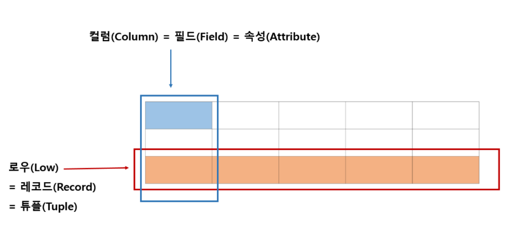
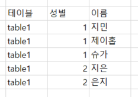

## 데이터 조회

### 데이터 테이블
- 기업 데이터는 테이블 형태(표)로 생성됨
- 테이블은 행(row)과 열(column)로 구성됨

- 컬럼(col) = 열 = 필드(field) = 속성(attribute) 
- 로우(row) = 행 = 데이터 레코드(record) = 튜플(tuple)

#### 데이터 테이블 예시
- `table1` : 성별과 이름을 수집한 데이터


<br>

### SELECT 구문
- 기본 양식
```sql
SELECT {가져오고 싶은 데이터} 
FROM {조회하는 데이터 테이블}
```

- 전체 조회하기(`*` : 아스타, 전체 컬럼을 불러오는 약속된 기호)
```sql
SELECT * 
FROM {조회하는 데이터 테이블}
```

- 원하는 컬럼만 조회하기
```sql
SELECT NAME, ID
FROM {조회하는 데이터 테이블}
```

- 데이터 일부만 조회하기(대용량 데이터의 생김새만 살펴보기 위해서 활용)
```sql
SELECT NAME, ID
FROM {조회하는 데이터 테이블}
LIMIT 5
```

<br>

### 주의사항
- SQL은 대소문자를 구분하지 않음
- 예약어(`SELECT`)는 대문자, 나머지 테이블과 컬럼은 소문자를 쓰는 것을 권장


<BR>

데이터리안님의 [데이터 분석을 위한 SQL 로드맵(인프런)][H]을 참고하여 정리하였습니다.

[H]: https://www.inflearn.com/roadmaps/400 