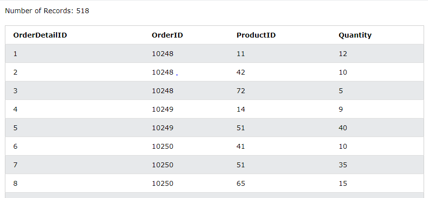

### 데이터 요약하기

이글은 데이터리안님의 [데이터 분석을 위한 SQL 중급(인프런)][H]을 참고하여 정리하였습니다. 

[H]: https://www.inflearn.com/course/%EB%8D%B0%EC%9D%B4%ED%84%B0-%EB%B6%84%EC%84%9D-%EC%A4%91%EA%B8%89-sql/dashboard

#### 목차
- [데이터 요약 통계](#데이터-요약-통계 ) 
- [데이터 집계하기](#데이터-집계하기)


---

### 데이터 요약 통계 
#### Customers 테이블
- [SQL 실습 사이트][I]

[I]: https://www.w3schools.com/sql/trysql.asp?filename=trysql_select_all


#### OrderDetails 테이블



<br>

#### COUNT
- `COUNT(*)` : 데이터 크기(NULL 포함)
- `COUNT(City)` : 컬럼의 데이터 수(NULL값 제외)
- `COUNT(DISTINCT City)` : 컬럼의 UNIQUE 데이터 수(NULL 제외)

```sql
SELECT COUNT(*) -- 데이터 크기
    , COUNT(City) -- City 컬럼의 데이터 수
    , COUNT(DISTINCT City) -- City 컬럼의 UNIQUE 데이터 수
FROM CUSTOMERS
```


<br>

#### SUM, MIN, MAX
- `SUM({컬럼})` : 수치형 컬럼의 합(NULL 제외)
- `MIN({컬럼})` : 수치형 컬럼의 최솟값(NULL 제외)
- `MAX({컬럼})` : 수치형 컬럼의 최댓값(NULL 제외)
```sql
SELECT SUM(Quantity)
    , MIN(Quantity)
    , MAX(Quantity)
FROM OrderDetails
```


<br>

#### AVERAGE
- `AVG({컬럼})` : 수치형 컬럼의 평균(NULL값과 수를 제외)
##### NULL을 무시하고 평균 구하기
- NULL값을 데이터에서 제외하기
- 평균식 : SUM(컬럼) / COUNT(컬럼)
##### NULL을 포함하고 평균 구하기
- 때로는 NULL값을 0으로 생각하기 
- 평균식 : SUM(컬럼) / COUNT(*)
```sql
SELECT ROUND(AVG(Quantity), 2)
    , ROUND(SUM(Quantity) / COUNT(*), 2)
FROM OrderDetails
```


---

### 데이터 집계하기
- 현업에서 테이블 전체의 컬럼을 요약하기보다는 특정 구간을 나누어서 계산함
- 특정 지역, 연령, 산업별로 데이터 패턴을 찾는 것이 데이터분석가 OR 엔지니어가 하는 일

<br>

#### Products 테이블


<br>

#### GROUP BY
- 기준 컬럼을 항상 SELECT에도 적어주어야 함
```sql
SELECT {기준 컬럼}, {집계 함수}
FROM {테이블}
GROUP BY {기준 컬럼}
```
<br>

#### GROUP BY 기준 1개
##### 공급자별로 취급하는 평균 물건 가격을 확인하기 
```sql
SELECT SupplierID, AVG(Price) AS AVG_Price
FROM Products
GROUP BY SupplierID
ORDER BY AVG_Price 
``` 


- 판매하는 제품 중에서 가장 저렴한 상품의 가격이 4.5 

<br>

#### GROUP BY 기준 2개
##### 공급자 기준으로 취급하는 카테고리별 평균 물건 가격을 확인하기 
```sql
SELECT SupplierID, CategoryID
     , AVG(Price) AS AVG_Price
FROM Products
GROUP BY SupplierID, CategoryID
ORDER BY SupplierID, CategoryID, AVG_Price DESC
``` 


- 2번 공급자가 취급하는 2번 상품의 평균 가격이 20.35

<br>

#### GROUP BY 조건문
##### 공급자 기준으로 취급하는 카테고리별 평균 물건 가격 중 50이상인 데이터 조회하기
- `HAVING` : `GROUP BY`의 조건문
- `WHERE`은 `GROUP BY` 전에 실행되기 때문에 주어진 문제에서는 활용할 수 없음
```sql
SELECT SupplierID
     , CategoryID
     , AVG(Price) AS AVG_Price
FROM Products
GROUP BY SupplierID, CategoryID
HAVING AVG_Price >= 50
ORDER BY SupplierID, CategoryID, AVG_Price DESC
```


<br>

##### 👏 SQL 코드 TIP
- SELECT에서 여러 컬럼를 조회해야할 때, 컬럼은 아래와 같이 나열하는 것을 권장
```sql
SELECT COL1
     , COL2
     , COL3
     ...
``` 

---

