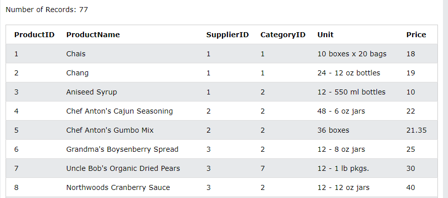
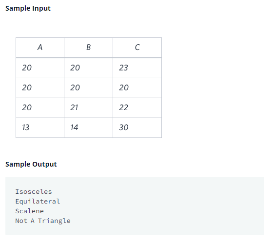

### 데이터 요약하기

이글은 데이터리안님의 [데이터 분석을 위한 SQL 중급(인프런)][H]을 참고하여 정리하였습니다. 

[H]: https://www.inflearn.com/course/%EB%8D%B0%EC%9D%B4%ED%84%B0-%EB%B6%84%EC%84%9D-%EC%A4%91%EA%B8%89-sql/dashboard

#### 목차
- [조건문 CASE](#조건문-CASE) 
- [연습문제](#연습문제)

---

### 조건문 CASE 
- `CASE` : IF/ELIF 개념
- `조건1`은 `AND/OR` 논리연산자를 이용해서 여러 조건을 넣어도 됨
- `CASE` 구문을 이용해서 만든 결과를 `*`와 같이 출력해서 조건에 맞게 만들어졌는지 확인하기 
> 1. 조건문이 특수한 경우을 WHEN에 넣기
> 2. 조건문이 여러 개를 만족하는 부분은 ELSE에 넣기
```sql
CASE 
     WHEN {조건1} THEN {결과1}
     WHEN {조건1} THEN {결과2}
     ELSE {결과3}
END AS {컬럼명}
```

<br>


#### PRODUCTS 테이블
- [SQL 실습 사이트][I]

[I]: https://www.w3schools.com/sql/trysql.asp?filename=trysql_select_all



<br>

#### 카테고리 ID에 맞게 카테고리 이름 컬럼 생성
- `1` : 음료
- `2` : 조미료
- `3` : 기타
```sql
SELECT CASE 
            WHEN CategoryID = 1 THEN '음료'
            WHEN CategoryID = 2 THEN '조미료'
            ELSE '기타'
        END AS CategoryName
        , * -- 전체 컬럼을 같이 출력해서 조건에 맞게 생성되었는지 확인하기
FROM PRODUCTS
```


<br>

#### 조건문과 GROUP BY
- 카테고리 이름별로 평균가격 조회하기
```sql
SELECT CASE 
            WHEN CategoryID = 1 THEN '음료'
            WHEN CategoryID = 2 THEN '조미료'
            ELSE '기타'
        END AS CategoryName
        , AVG(PRICE)
FROM PRODUCTS
GROUP BY CategoryName
```


---

### 연습문제
#### 해커랭크 Type of Triangle
- 문제는 [여기][Q]

[Q]: https://www.hackerrank.com/challenges/what-type-of-triangle/problem?h_r=internal-search

- 문제 : 세 변의 길이를 사용하여 TRIANGLES 테이블의 각 레코드 유형을 식별하는 쿼리를 작성하십시오. 테이블의 각 레코드에 대해 다음 명령문 중 하나를 출력합니다.

- 정삼각형(Equilateral): 변의 길이가 같은 삼각형입니다.
- 이등변(Isosceles): 변의 길이가 같은 삼각형입니다.
- Scalene: 변의 길이가 다른 삼각형입니다.
- Not A Triangle: 주어진 A, B, C 값은 삼각형을 형성하지 않습니다.



#### 해설
1. 조건문이 특수한 경우을 WHEN의 가장 위에 배치하기
    - `삼각형이 아닌 조건 -> 정상감형 조건 -> 이등변 삼각형 조건 -> 그외 일반 삼각형`
    - 만약 `이등변 삼각형 -> 정삼각형 조건`을 하면, 정상각형은 이등변 삼각형 조건에 걸리기 때문에 변환할 수 없음
```sql
--  이등변 삼각형 -> 정삼각형 조건
CASE 
     WHEN A = B OR A = C OR B = C THEN 'Isosceles'
     WHEN A = B AND A = C THEN 'Equilateral'
     ELSE 'others'
END AS TypeTriangle
```


2. 일반적인 조건은 ELSE에 넣기

```sql
SELECT CASE 
            WHEN (A + B <= C) OR (A + C <= B) OR (B + C <= A) THEN 'Not A Triangle'
            WHEN A = B AND B = C THEN 'Equilateral'            
            WHEN A = B OR A = C OR B = C THEN 'Isosceles'
            ELSE 'Scalene'
       END AS TypeTriangle
FROM TRIANGLES
``` 

