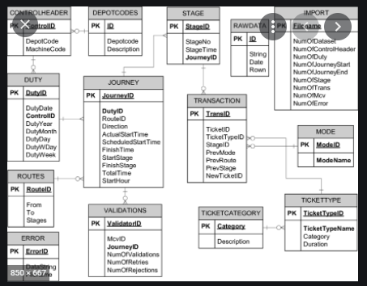
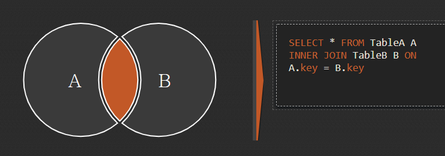
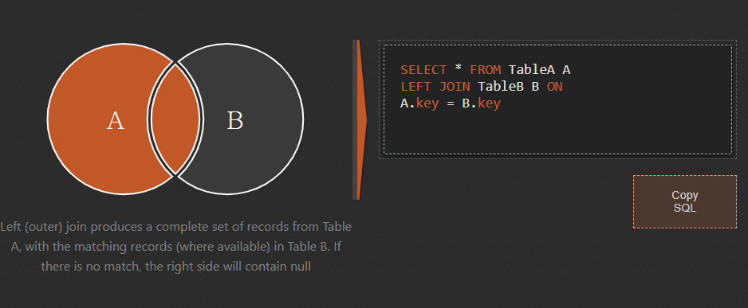
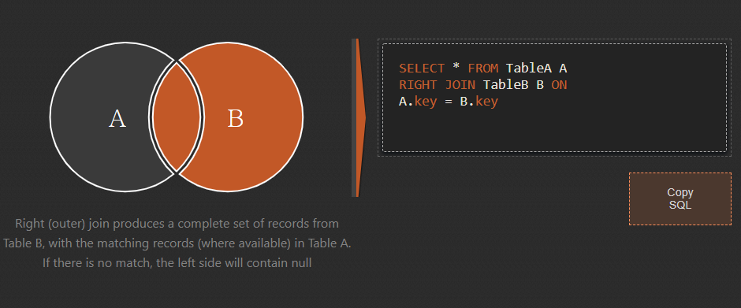
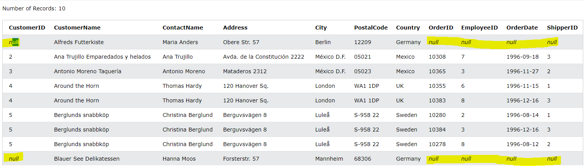

### 데이터 결합하기

이글은 데이터리안님의 [데이터 분석을 위한 SQL 중급(인프런)][H]을 참고하여 정리하였습니다. 

[H]: https://www.inflearn.com/course/%EB%8D%B0%EC%9D%B4%ED%84%B0-%EB%B6%84%EC%84%9D-%EC%A4%91%EA%B8%89-sql/dashboard

#### 목차
- [INNER JOIN](#INNER-JOIN) 
- [OUTTER JOIN](#OUTTER-JOIN) 
- [연습문제](#연습문제)

---
### RDB(관계형 데이터베이스)
- 현업에서 하나의 테이블 보다는 여러 개의 테이블을 결합해서 정보를 집계하는 경우가 대부분
- 관계형 데이터 베이스는 키가 되는 공통 컬럼을 이용해서 결합을 함


```sql
-- 구식버전, 비효율적
SELECT *
FROM USERS, ORDERS -- 만들 수 있는 두 테이블 조합을 다 만듦
WHERE USERS.ID = ORDERS.ID -- 공통 키 값을 이용
```

<br>

### ERD(개체-관계 모델)
- 데이터베이스 간의 관계를 그림으로 도식화하기
- 기본 키값이 이름이 다를 수도 있기때문에 테이블마다 어떤 관계를 가지는지 도식화하기



### JOIN 시각화 이용하기
- [여기][v]

[v]: https://sql-joins.leopard.in.ua/


---

### INNER JOIN
- 기준과 참조 테이블 **모두 공통 부분**만 있을 때만 데이터를 출력함

```sql
SELECT * 
FROM TableA A
INNER JOIN TableB B ON
A.key = B.key
```



<br>

#### 거래내역이 있는 고객 정보 테이블 만들기 
- 거래 내역에 고객 정보 붙이기
- CUSTOMERS 테이블 : 고객 정보
- ORDERS 테이블: 고객들의 상품 거래 내역
```sql
SELECT *
FROM ORDERS AS A -- 기준 테이블 
INNER JOIN CUSTOMERS AS B -- 참조 테이블
ON A.CUSTOMERID = B.CUSTOMERID -- 공통 키 값을 이용
```

<br>

#### 거래내역이 있는 고객 정보와 그 상품의 공급자 정보 테이블 만들기
- 거래 내역에 고객 정보, 공급자 정보 붙이기
- join을 두 번하여 `거래내역` 테이블에 고객정보와 공급자 정보를 붙이기

```sql
SELECT *
FROM ORDERS AS A -- 기준 테이블 
INNER JOIN CUSTOMERS AS B -- 참조 테이블
ON A.ID = B.ID -- 공통 키 값을 이용
INNER JOIN SHIPPERS AS C
ON A.ShipperID = C.ShipperID
```

---

### OUTER JOIN
- 기준 테이블에 참조테이블의 공통 키값을 이용해서 자료를 갖다 붙이는 개념
- 따라서 기준 테이블 중에 참조테이블에 없는 값은 NULL값으로 표시됨
- LEFT JOIN(LEFT OUTER JOIN) : 왼쪽 테이블을 기준으로 자료를 합치는 경우
- RIGHT JOIN(RIGHT OUTER JOIN) : 오른쪽이 테이블을 기준으로 자료를 합치는 경우

<br>

### LEFT OUTER JOIN
- `LEFT OUTER JOIN`과 `LEFT JOIN`은 같은 구문
- OUTER JOIN 중에서 문법이 `LEFT`와 `RIGHT`비슷해서 `LEFT JOIN`을 주로 사용함



```sql
SELECT * 
FROM TableA AS A -- 기준 테이블
LEFT JOIN TableB AS B -- 참조 테이블
ON A.key = B.key
```
<br>

### RIGHT OUTER JOIN


```sql
SELECT * 
FROM TableA AS A -- 기본 테이블
RIGHT JOIN TableB B -- 참조 테이블
ON A.key = B.key
```

<br>

#### 고객정보에 거래내역을 붙여서, 거래이력이 있는 회원과 아닌 회원 확인하기
- 고객정보(기준 테이블)에 거래내역(참조테이블)을 갖다붙이기  

```sql
SELECT *
FROM CUSTOMERS AS A -- 기준 테이블 
LEFT OUTER JOIN ORDERS AS B -- 참조 테이블
ON A.CUSTOMERID = B.CUSTOMERID
```



---

### 연습문제 
#### SELF JOIN
- 자신 테이블을 JOIN해서 데이터를 조회하기

- 문제는 [여기][Q]

[Q]: https://leetcode.com/problems/rising-temperature/

- 문제 : 어제보다 오늘 온도가 높은 오늘의 id를 조회하세요
- Weather table

```sql
+---------------+---------+
| Column Name   | Type    |
+---------------+---------+
| id            | int     |
| recordDate    | date    |
| temperature   | int     |
+---------------+---------+
id is the primary key for this table.
This table contains information about the temperature in a certain day.
```
- Write an SQL query to find all dates' id with higher temperature compared to its previous dates (yesterday).
- Return the result table in any order.

- The query result format is in the following example:
```sql
Weather
+----+------------+-------------+
| id | recordDate | Temperature |
+----+------------+-------------+
| 1  | 2015-01-01 | 10          |
| 2  | 2015-01-02 | 25          |
| 3  | 2015-01-03 | 20          |
| 4  | 2015-01-04 | 30          |
+----+------------+-------------+

Result table:
+----+
| id |
+----+
| 2  |
| 4  |
+----+
In 2015-01-02, temperature was higher than the previous day (10 -> 25).
In 2015-01-04, temperature was higher than the previous day (20 -> 30).
```

#### 해설
1. SELF JOIN
- 오늘의 `recordDate` 행 옆에, 어제의 `recordDate` 자료를 붙이기
- ex) `2021-07-18`(기준테이블) | `2021-07-17`(참조테이블)
- JOIN KEY : `오늘의 날짜에서 하루 빼기 = 어제의 날짜` OR  `오늘의 날짜 = 어제의 날짜에서 하루 더하기`

2. `DATE_ADD` OR `DATE_SUB`를 활용해서 KEY값 설정하기  
##### 시간을 다루는 함수
- `DATE_ADD(기준날짜, INTERVAL)`
    - `SELECT DATE_ADD(NOW(), INTERVAL 1 SECOND)` : 현재 날짜(`NOW()`)에 1초를 더하기
    - `SELECT DATE_ADD(NOW(), INTERVAL 1 MINUTE)` : 현재 날짜(`NOW()`)에 1분를 더하기
    - `SELECT DATE_ADD(NOW(), INTERVAL 1 HOUR)` : 현재 날짜(`NOW()`)에 1시간을 더하기
    - `SELECT DATE_ADD(NOW(), INTERVAL 1 DAY)` : 현재 날짜(`NOW()`)에 1일 더하기
    - `SELECT DATE_ADD(NOW(), INTERVAL 1 MONTH)` : 현재 날짜(`NOW()`)에 1달을 더하기
    - `SELECT DATE_ADD(NOW(), INTERVAL 1 YEAR)` : 현재 날짜(`NOW()`)에 1년을 더하기
    - `SELECT DATE_ADD(NOW(), INTERVAL -1 YEAR)` :
    현재 날짜(`NOW()`)에 -1년을 더하기
- `DATE_SUB(기준날짜, INTERVAL)`
    - `SELECT DATE_SUB(NOW(), INTERVAL 1 SECOND)`


```sql
SELECT TODAY.ID
FROM Weather AS TODAY
LEFT OUTER JOIN Weather AS YESTERDAY
ON DATE_ADD(TODAY.recordDate, INTERVAL -1 DAY) = YESTERDAY.recordDate
WHERE TODAY.Temperature > YESTERDAY.Temperature
;
```

---

#### 👏 SQL ERROR TIP
#### ambiguous
- `THE COLUM IS ambiguous` : 두 개의 테이블에서 동일한 컬럼이 있을 때, 컬럼의 테이블을 정확히 밝혀주기

```sql
SELECT A.NAME -- 컬럼의 테이블을 정확히 밝혀주기
FROM A
INNER JOIN B
ON A.ID = B.ID
```