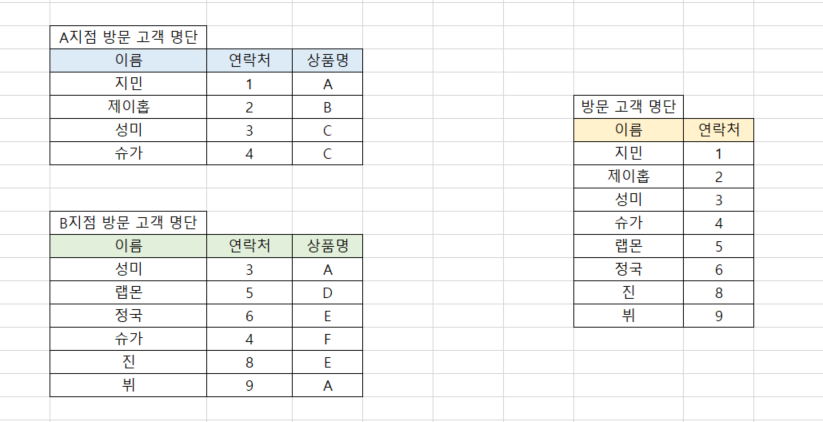
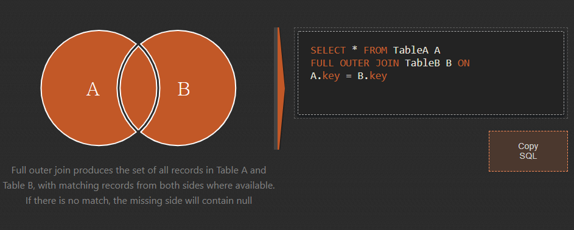
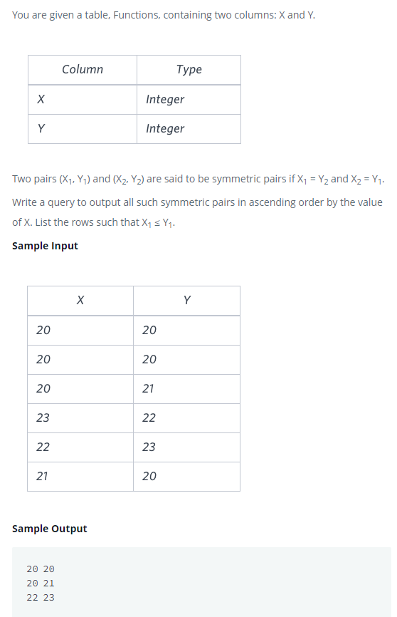

### 데이터 이어 붙이기

이글은 데이터리안님의 [데이터 분석을 위한 SQL 중급(인프런)][H]을 참고하여 정리하였습니다. 

[H]: https://www.inflearn.com/course/%EB%8D%B0%EC%9D%B4%ED%84%B0-%EB%B6%84%EC%84%9D-%EC%A4%91%EA%B8%89-sql/dashboard

#### 목차
- [UNION](#UNION)

---

### UNION 
- `JOIN` : 공통 KEY값을 이용해서 옆으로 데이터를 붙이기
- `UNION` : 데이터를 위 아래로 붙이기

<br>

#### 방문 고객 명단 만들기
- 각 지점별 고객 명단을 가져와서 중복을 제거하여 방문 고객 명단 만들기



<br>

#### UNION VS SELECT 
- `UNION` : 중복된 데이터는 삭제가 기본 사항
- `UNION ALL` : 중복된 값도 모두 보여줌
- `SELECT` : 모든 데이터를 다 보여주는 것이 기본사항, `DISTINCT`를 써야지 중복된 데이터를 제거가 가능

<br>

##### 가격이 5이하 또는 200이상인 데이터를 조회
1. SELECT 사용
```sql
SELECT *
FROM PRODUCTS
WHERE PRICE <= 5
    OR PRICE > 200
```

2. UNION 사용
```sql
-- 가격이 5이하인 데이터와 200이상인 데이터를 위 아래로 붙이기
SELECT *
FROM PRODUCTS
WHERE PRICE <= 5

-- UNION ALL : 중복된 데이터 모두 보여주기
UNION 

SELECT *
FROM PRODUCTS
WHERE PRICE > 200
```

<br>

#### FULL OUTER JOIN



- 공통 사항 외에 A테이블과 B테이블 각각에만 있는  모든 데이터를 확인할 때 `FULL OUTER JOIN`을 사용 
- MYSQL에는 지원하지 않아서 `UNIOIN`을 활용해서 데이터를 조회함

##### SQL 쿼리
```sql
-- A 테이블 LEFT JOIN
SELECT *
FROM A
LEFT OUTER JOIN B 
ON A.KEY = B.KEY

UNION

-- B 테이블 RIGHT JOIN
SELECT *
FROM A
RIGHT OUTER JOIN B
ON A.KEY = B.KEY
```

---

### 연습문제
#### 해커랭크
- 문제는 [여기][H]

[H]: https://www.hackerrank.com/challenges/symmetric-pairs/problem?h_r=internal-search

- (x,y) 쌍이 있는 functions 테이블에서 x,y가 symmetric한 행을 출력하기
- 단, x를 기준으로 오름차순으로 정렬하기 




<br>

#### 문제풀이 
- X,Y가 같은 경우와 X,Y가 같지 않은 경우를 `UNION`하여 문제를 풀기
- `UNION`은 전체 테이블에서만 ORDER BY를 할 수 있음
    - `UINION` 위에서는 ORDER BY를 할 수 없음
```sql
-- 1. x,y가 같은 경우
/*
X = Y면서 2개여야 함 
- GROUP BY를 통해서 COUNT가 2개인 데이터만 출력
- COUNT(*)는 조건값만 넣고 출력하지 않기
*/
SELECT X, Y
FROM FUNCTIONS
WHERE X = Y
GROUP BY X, Y
HAVING COUNT(*) = 2

UNION

-- 2. x,y가 같지 않은 경우
/*
SELF JOIN 활용
- (T1)기준 테이블 : X1, Y1 테이블
- (T2)참조 테이블 : X2, Y2 테이블
- KYE : T1.X = T2.Y AND T1.Y = T2.X

* 조건1 x1< y1(X1 != Y1 조건이 포함)인 SYMMETRIC 경우의 행을 출력
* 조건 X 값을 기준을 오름차순 정렬
*/

SELECT T1.X, T1.Y
FROM FUNCTIONS T1
INNER JOIN FUNCTIONS T2 
ON T1.X = T2.Y AND T1.Y = T2.X
WHERE T1.X < T1.Y

-- UNION은 전체 테이블 밑에서만 ORDER BY를 할 수 있음
ORDER BY X 
```


