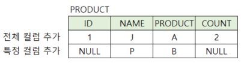
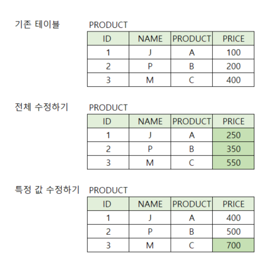
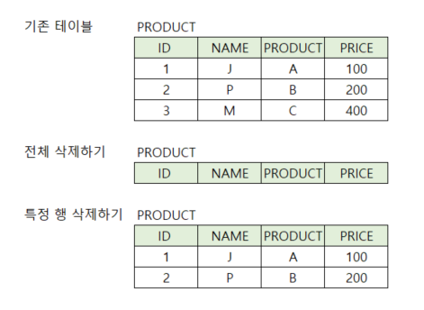

## DML(Data Manipulattion language)
- 데이터 조회 : SELECT 
- 데이터 조작 : INSERT , UPDATE, DELETE

---

### INSERT
- 기존 테이블에 데이터 추가하기
- 빈 테이블(`SELECT` 가능하지만 값이 없음)이라도 INSERT 가능
#### 기본 양식
```sql
/*컬럼 전체 데이터(행) 추가하기*/
INSERT INTO {테이블명} VALUES ({데이터_값}); 

/*특정 컬럼에 데이터(행) 추가하기*/
INSERT INTO {테이블명} ({특정 컬럼 리스트}) VALUES ({특정 컬럼_데이터_값});
```

#### INSERT 예시
```sql
/*컬럼 전체 데이터 추가하기*/
INSERT INTO PRODUCT VALUES ('1','J','A',2);

/*특정 컬럼 데이터 추가하기*/
INSERT INTO PRODUCT (NAME,PRODUCT) VALUES ('P','B');
```


---

### UPDATE
- 기존의 데이터를 수정하기
#### 기본 양식
- `=` : 참, 거짓을 구분하는 비교연산자
- `SET 컬럼 = 수정 값` : `SET`뒤에 쓰이는 `=`값은 대입연산자
```sql
/*전체 데이터(컬럼) 수정하기*/
UPDATE {테이블명} SET 컬럼 = 수정 값; 

/*특정 조건 데이터(컬럼) 수정하기*/
UPDATE {테이블명} SET 컬럼 = 수정 값 WHERE 조건; 
```

#### UPDATE 예시
```sql
/*전체 데이터(컬럼) 수정하기*/
UPDATE PRODUCT SET PRICE = PRICE + 150;

/*특정 조건의 데이터(컬럼) 수정하기*/
UPDATE PRODUCT SET PRICE = PRICE + 300 WHERE PRODUCT = 'C'; 
```


---

### DELETE
- 기존의 데이터 삭제하기
#### 기본 양식
```sql
/*전체 데이터(행) 삭제하기*/
DELETE FROM {테이블명}; 

/*특정 조건 데이터(행) 삭제하기*/
DELETE FROM {테이블명} WHERE 조건; 
```

#### DELETE 예시
```sql
/*전체 데이터(행) 삭제하기*/
DELETE * FROM PRODUCT;

/*특정 조건 데이터(행) 삭제하기*/
DELETE * FROM PRODUCT WHERE PRODUCT = 'C';
```
