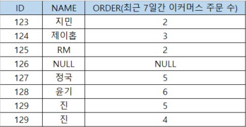
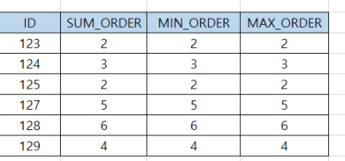

### SQL 기본 정리

데이터리안님의 [데이터 분석을 위한 SQL 로드맵(인프런)][H]을 참고하여 정리하였습니다.

[H]: https://www.inflearn.com/roadmaps/400 


### 목차
- [데이터 조회하기](#데이터-조회하기)
- [데이터 요약하기](#데이터-요약하기)
- [데이터 다루기](#데이터-다루기)
---

### 데이터 조회하기
```sql
SELECT {조회할 변수}
FROM {테이블}
```
<br>

### 특정 조건 데이터 가져오기
#### 2. 비교연산자
- `=` : 같다
- `>` : 크다
- `>=` : 크거나 같다
- `<` : 작다
- `<=` : 작거나 같다
- `<>` OR `!=` : 같지 않다.

##### 문자 비교연산자
- 알파벳 순서에 따라 T1 문자열이 `A`부터 `C` 이전 데이터들만 조회
```sql
SELECT * 
FROM TABLE
WHERE T1 < 'C' 
;
```

<br>

#### 3. 논리연산자
```sql
-- AND
SELECT *
FROM TABLE1
WHERE COL1 = '조건1' AND RATE > 3

-- ORF
SELECT *
FROM TABLE2
WHERE COL1 = '조건1' OR COL2 = '조건2'
```

<br>

#### 4. LIKE 
```sql
-- S로 시작하는 데이터 조회
SELECT *
FROM TABLE1
WHERE NAME LIKE 'S%';

-- S로 시작하지 않는 데이터 조회
SELECT *
FROM TABLE1
WHERE NAME NOT LIKE 'S%';
```
##### LIKE와 같이 쓰는 문법
- `%` : 와일드 카드 ex) 특정 문자 포함된 데이터 조회
- `_` : 1글자 와일드 카드 ex) 문자 글자 수 
- `\%` OR `\_` : 실제 `%`와 `_`를 조회할 때 `\`(이스케이프) 사용 
```sql
-- S로 시작하면서 4글자인 데이터 조회
SELECT *
FROM TABLE2
WHERE COL1 = `S%` 
    AND COL2 = `S___` 
```

<br>

#### 5. IN, BETWEEN
```sql
-- IN : 국가가 한국과 미국인 데이터를 조회 
SELECT *
FROM TABLE1
WHERE COUNTY IN (`Korea`, `USA`);

-- BETWEEN : 나이가 10과 19인 데이터를 조회 
SELECT *
FROM TABLE1
WHERE AGE BETWEEN 10 AND 19
```

<br>

#### 6. IS NULL, NOT IS NULL
```sql
-- NULL인 데이터 조회
SELECT *
FROM TABLE1
WHERE COUNTY IS NULL

-- NULL이 아닌 데이터 조회
SELECT *
FROM TABLE1
WHERE AGE IS NOT NULL
```

---

### 데이터 요약하기 
#### 이머커스 데이블(ELCO_TABLE)



#### 1. 데이블 전체 크기 확인
```sql
SELECT COUNT(*) 
FROM ELCO_TABLE
``` 
- 실행 결과 : 8
- NULL값이 포함된 데이터도 COUNT함

#### 컬럼의 데이터 크기 확인
```sql
SELECT COUNT(NAME) 
FROM ELCO_TABLE
``` 
- 실행 결과 : 7
- NULL값이 포함된 데이터는 COUNT하지 않음

#### 컬럼의 UNIQUE 데이터 크기 확인
```sql
SELECT COUNT(DISTINCT NAME)
FROM ELCO_TABLE
``` 
- 실행 결과 : 6
- NULL값이 포함된 데이터는 COUNT하지 않음

<br>

#### 2. 컬럼의 합 구하기
```sql
SELECT SUM(ORDER) 
FROM ELCO_TABLE
``` 
- 실행 결과 : 27

#### 컬럼의 평균 구하기
```sql
-- ROUND(SUM(ORDER) / COUNT(*), 2) 와는 다른 결과
SELECT ROUND(AVG(ORDER),2) 
FROM ELCO_TABLE
``` 
- 실행 결과 : 3.86
- 전체 합/총 COUNT(NULL제외)

#### 컬럼의 MIN/MAX 구하기
```sql
SELECT MIN(ORDER), MAX(ORDER)  
FROM ELCO_TABLE
``` 
- 실행 결과 : 2, 6

<br>

#### 3. GROUP BY
- SELECT에 그룹화 기준 컬럼과 계산함수 반드시 적기
- `HAVING` : `GROUP BY`의 조건문
```sql
SELECT ID
    , SUM(ORDER) AS SUM_ORDER
    , MIN(ORDER) AS MIN_ORDER
    , MAX(ORDER) AS MAX_ORDER
FROM ELCO_TABLE
GROUP BY ID
-- GROUP BY의 조건 주기
-- HAVING SUM(ORDER) >= 4
``` 
- 실행결과



<br>

#### 4. ORDER BY
- 오름차순 : `ASC`, 기본 default 값
- 내림차순 : `DESC`
- `LIMIT` : 데이터 노출 수 정하기, ORDER BY와 자주 사용되는 구문(단독으로 자주 사용) 
```sql
SELECT * 
FROM ELCO_TABLE
ORDER BY ID
LIMIT 3
``` 

---

### 데이터 다루기

#### 1. 문자열 자르기
- `LEFT('문자열', 자르는 INDEX)` : 왼쪽에서 자르기
- `RIGHT('문자열', 자르는 INDEX)` : 오른쪽에서 자르기
- `SUBSTR('문자열', 시작 INDEX, 끝 INDEX)` : 부분으로 자르기
```sql
SELECT LEFT('20210711', 4)
    , RIGHT('20210711', 4)
    , SUBSTR('20210711', 1,4)
    , SUBSTR('20210711', 5)
FROM TABLE3
``` 
- 실행 결과 : 2021, 0711, 2021, 0711

<br>

#### 2. 소수점 처리
- `CEIL(소수)` : 올림
- `FLOOR(소수)` : 버림
- `ROUND(소수, 반올림 자리)` : 반 올림
```sql
SELECT CEIL(2.5)
    , FLOOR(2.5)
    , ROUND(2.1234, 2)
FROM TABLE3
``` 
- 실행 결과 : 3, 2, 2.12